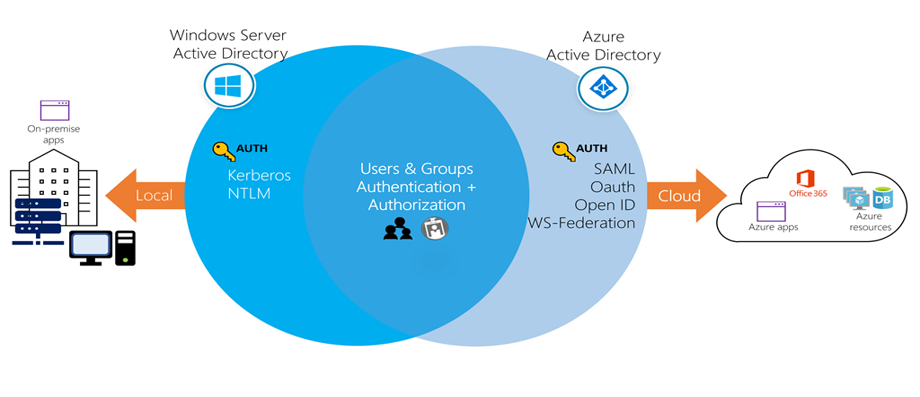

# Azure Active Directory

 

Azure Active Directory (AAD or Azure AD) is a cloud-based identity and access management service.

# Key Concepts for Azure AD

- <strong>Identity:</strong> An object that can get authenticated.

- <strong>Account:</strong> An identity that has data associated with it. You can't have an account without an identity.

- <strong>Azure AD Account:</strong> An identity created through Azure AD or another Microsoft cloud service, such as Microsoft 365. Identities are stored in Azure AD and accessible to your organization's cloud service subscriptions. This account is also sometimes called a Work or school account.

# User Accounts and Groups

