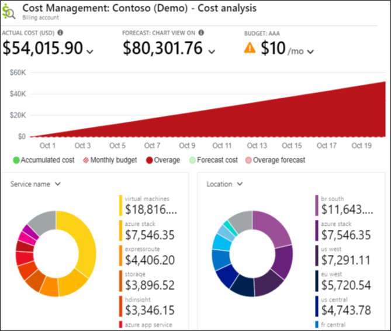

# Resource Limits

<stromg>Azure Resource Manager (ARM)</stromg> imposes limits and quotas on how many resources of each type you can provision per Azure Subscription, and even per Azure Region. Some limits are a hard maximum, while others are a soft limit that can be increases upon request

# Cost Management

You use Azure Cost Management and Billing features to conduct billing administrative tasks and manage billing access to costs. You also use its features to monitor and control Azure spending and to optimize Azure resource usage.

 
